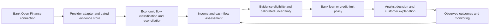

# Bank underwriting and credit-limit assessment

> **Superseded evidence.** Citations below point at the `production-0.11.0` bundle and the
> `0.11.0` calibration. That release has been replaced by `production-0.12.0` under
> [ADR 0009](adr/0009-routing-narrowed-and-recalibrated.md), which narrows routing, refits the
> calibration around it, and records different out-of-distribution numbers. The findings here
> still hold; the file paths and figures are the ones that were current when it was written.

Assessment date: 2026-09-05. Repository baseline: `896ebc4`. Primary use case: Brazilian retail loan underwriting and credit limits, as confirmed by the project owner.

## Recommendation

Develop the project into a cash-flow underwriting service. Preserve income estimation as an independently evaluated component, then add affordability analysis, evidence sufficiency, and an integration with the bank's credit policy.

The existing project is a well-structured research baseline. Its strongest assets are reproducibility, explicit target definitions, observed/private-data separation, and transaction-level explanations. Its largest gaps are real-data applicability and a connection to lending outcomes. Further optimization against the current simulator would have limited evidence of commercial value.

The proposed bank-facing promise is: **provide an auditable basis for determining which income can support repayment, what obligations consume it, when evidence is insufficient, and how that changes a lending decision.** Improvements in approval rates, losses, or revenue remain hypotheses until measured with a bank.

## Verified current state

The runtime combines a recurring-income rule engine, a custom gradient-boosted sustainable-income model, deterministic routing, and calibrated intervals. It uses 104 customer-month features. The Streamlit demo generates synthetic applicants and displays estimates alongside private simulation truth. No provider adapter currently connects consented Open Finance payloads to the estimator.

Useful foundations to retain:

- Strict, immutable internal contracts and integer monetary amounts.
- Private labels joined only after observed features are computed.
- Customer-disjoint training and evaluation, with dedicated uncertainty populations.
- Artifact digests, immutable deployment bundles, and refusal to load incompatible model/calibration pairs.
- Explanations tied to transaction decisions and model contributions.
- Explicit reporting of failed experiments and weak stress cases.

These are supported by [the production loader](../estimator/src/income_estimator/production.py), [dataset construction](../estimator/training/capacity_datasets.py), [model cards](../estimator/docs/model-cards.md), and [the demo boundary](../demo_app/service.py).

### Validation performed for this assessment

| Check | Result |
| --- | --- |
| Estimator tests | 198 passed; 4 clean-install tests skipped by their opt-in gate |
| Simulator tests | 320 passed; 1 failed |
| Demo service tests | 31 passed |
| Ruff over all three components | Passed |
| Deployment bundle integrity and construction | Passed |
| Focused synthetic transaction probes | Confirmed language sensitivity and a false own-transfer exclusion |

Tests ran on the available Python 3.14.4 environment with Pydantic 2.13.4, PyArrow 23.0.1, and PyYAML 6.0.3. Pytest 8.4.2 and Ruff 0.16.3 were installed into a temporary directory without changing project dependencies. CI targets Python 3.13, so this is not a claim that the CI environment was reproduced. The browser UI, clean-wheel installation, full training, and stress-population regeneration were not exercised. Stress metrics below were read from committed reports.

The simulator failure has a concrete fixture problem: `test_phase7_reference_population_is_byte_stable` compares the entire generated tree with a reference tree. Git tracks only two JSON files in that reference; the generated tree contains ten additional Parquet files. The root `.gitignore` ignores `*.parquet`. The test cannot match this checkout's reference tree, regardless of possible cross-runtime byte differences. Restore a narrowly allowlisted synthetic fixture, or version an independently reviewed manifest of expected files and hashes. Do not regenerate expected results automatically inside the test.

Evidence: [the failing assertion](../finances_simulator/tests/test_scale_and_estimator_integration.py), line 206; [ignore rules](../.gitignore); and [the reference directory](../finances_simulator/examples/generated/phase7_population_seed_100_count_2).

## Findings that matter to underwriting

### 1. The estimator can misread ordinary payment evidence

Using one synthetic R$5,000 credit on the same date and account, with only its description changed:

| Description / condition | Realized estimate | Decision |
| --- | --- | --- |
| `SALARY` | R$5,000 | Income |
| `SALÁRIO` | R$0 | Ambiguous, unrecognized credit |
| `FOLHA DE PAGAMENTO` | R$0 | Ambiguous, unrecognized credit |
| `PIX RECEBIDO EMPREGADOR` | R$0 | Ambiguous, unrecognized credit |
| `SALARY`, plus an unrelated R$5,000 rent debit in another observed account on the same date | R$0 | Excluded as an own-account transfer |

These are controlled examples of current behavior, not estimates of real-world error frequency. Ambiguity is reasonable for a generic PIX description; exposing the resulting zero without an evidence-sufficiency decision is the problem for downstream lending.

The own-transfer matcher treats any same-date, same-amount debit on another account as a transfer counterpart. It does not require ownership or counterparty linkage. English income keywords dominate the rules, while the stream detector groups only credits already classified as income. Recurrence alone therefore cannot recover every unfamiliar description.

Evidence: [income rules](../estimator/src/income_estimator/transaction_intelligence/rules.py), lines 13–40 and 82–102; [transfer matching](../estimator/src/income_estimator/transaction_intelligence/features.py), lines 120–127; [stream detection](../estimator/src/income_estimator/income_streams/detector.py), lines 113–116.

**Change:** use provider transaction types, available counterparty identity, ownership evidence, payment timing, and learned classifications from reviewed Brazilian transactions. Model transfers as linked economic flows; require evidence stronger than coincident amounts. Preserve uncertain credits for review and distinguish “income not established” from “income established as zero.” Adding Portuguese keywords is an immediate patch, not sufficient real-data validation.

Official Open Finance guidance describes counterparty information for payment types, including PIX and payroll, with exceptions. It also describes transaction statuses and circumstances in which identifiers may change. The adapter must preserve that information and handle exceptions and lifecycle updates explicitly. [Open Finance Brasil account guidance](https://openfinancebrasil.atlassian.net/wiki/spaces/OF/pages/1739096252/Orienta%2Bes%2B-%2BDC%2BContas).

### 2. Current uncertainty is unsuitable for automatic credit sizing

| Committed evaluation | Interval coverage | Published customer-months | Sustainable-income WAPE |
| --- | --- | --- | --- |
| Release lockbox, familiar scenario families | 91.19% | 8,626 / 8,640 | Separate point-model evaluation |
| Noisy stress suite | 34.82% | 224 / 240 | 3.03% |
| High-volatility stress suite | 15.81% | 234 / 240 | 41.04% |

The nominal interval coverage is 80%. Each stress suite contains only 20 customers observed over 12 months, so these are diagnostic synthetic results, not population estimates for a bank. In the noisy suite, mean heuristic confidence is 74.42% despite only 34.82% interval coverage. Confidence and coverage are different quantities, but the score provides no reliable warning of this failure.

The support check uses independent feature ranges and accepts missing values. It can miss unfamiliar combinations that fall within every range. Even when the interval is withheld, the sustainable point estimate remains available. A policy consumer can therefore still act on an unsupported point estimate.

**Change:** add an explicit eligibility result for each downstream use: supported, review required, or insufficient evidence. Missing intervals and unsupported conditions must affect credit-policy eligibility, not merely chart rendering. Validate joint feature support, source/domain missingness, recency, classification ambiguity, and empirically observed errors. Use the rate of publication together with error and coverage among published cases; a system cannot pass by refusing everyone or by publishing unjustified estimates.

Separate an evidence-quality score from calibrated outcome probabilities. Measure harmful overestimation directly and use fresh, customer-disjoint and later-period data to choose and validate abstention thresholds. Keep known noisy and volatile conditions in regression evaluation; introduce new unseen conditions for generalization tests rather than repeatedly tuning on the same stress set.

Evidence: [released lockbox report](../estimator/bundles/production-0.11.0/provenance/lockbox-conditional-selector-intervals-0.11.0-release-report.json), [stress report](../estimator/evaluation/baselines/stress-0.11.0-report.json), [support envelope](../estimator/src/income_estimator/models/uncertainty.py), and [ensemble publication](../estimator/src/income_estimator/models/ensemble.py), lines 225–254.

### 3. Sustainable income is not repayment capacity

The current synthetic target averages expected receipts from active recurring sources over the next twelve months under source state at the cutoff. It excludes post-cutoff life events. Thus future job loss does not lower the current sustainable target by construction. This is a useful current income-rate target, but its interval does not measure all future cash-flow risk over a loan term.

The model also does not define a disposable-income target after essential expenses, taxes where relevant, and debt service. Business/service receipts are included in income targets without a separate bank-ready definition of business turnover versus personal disposable earnings. Cards, debt, and investments already supply some model features; their presence does not constitute an affordability calculation.

**Change:** define and evaluate three distinct quantities:

1. Recognized historical receipts, with source type and gross/net/unknown interpretation.
2. Recurring personal income accepted under a versioned bank policy, with clear treatment of bonuses, benefits, rent, business costs, and owner withdrawals.
3. Forward available cash after essential spending, existing debt service, and a policy buffer, with horizon-specific stress scenarios.

Keep current-state income estimation separate from forecasts of income loss and payment shortfall. For example, R$6,000 of accepted net income, R$2,500 of essential spending, R$1,500 of existing debt service, and a hypothetical R$500 buffer leave R$1,500 monthly headroom under those assumptions. That arithmetic alone does not establish an approvable loan or card limit.

Loan sizing must consider scheduled installments, term, pricing, liquidity timing, and bank risk limits. Revolving credit needs utilization and drawdown scenarios, exposure, and repayment behavior. An income multiple cannot replace either policy. Do not interpret subtraction of independently estimated marginal quantiles as a calibrated distribution of disposable income.

Evidence: [target construction ADR](adr/0002-income-target-construction.md), lines 74–109; [existing product features](../estimator/src/income_estimator/features/capacity.py).

### 4. Coverage assumptions need redesign for real feeds

The input contract carries `configured_coverage_percent`, `eligible_record_count`, and `observed_original_record_count`. These are useful simulator diagnostics. A production receiver cannot generally know what fraction of a customer's entire financial life was withheld. Completeness of fetched pages for an authorized account is a different measure from completeness across all institutions and income sources.

**Change:** replace the single implied completeness concept with explicit dimensions: authorized resources, fetched date ranges, pagination completion, refresh time, feed errors, known missing domains, and unknown external-account coverage. Preserve unknown states. Never scale total income upward merely because some institutions were not shared.

Require effective time and first-observed time, plus versioned changes, for product records used in historical validation. Transactions already have an observation date; input 1.2 explicitly lacks arrival timestamps for product records. A provider adapter must not imply historical availability merely because a balance or invoice has an older business date.

Evidence: [coverage contract](../estimator/src/income_estimator/contracts/v1.py), lines 80–86; [coverage features](../estimator/src/income_estimator/features/coverage.py); [product-contract limitation](../estimator/src/income_estimator/contracts/v1_2.py), lines 9–11; [cutoff slicing](../estimator/src/income_estimator/features/point_in_time.py), lines 47–88.

### 5. The public contract mixes point estimates and probability claims

The sustainable point prediction is returned as `sustainable_income_p50_minor`. The capacity regressor is trained with squared error on a log target, and deterministic routing can select last month's cash flow. Neither establishes a conditional median. Separately, inherited realized-income fields named `confidence_lower_minor` and `confidence_upper_minor` can contain heuristic bands, including a fixed 5% margin.

**Change:** introduce a new contract version with explicit point-estimate fields and separately typed calibrated quantiles. Publish a median claim only if trained and validated as such. Identify target, horizon, interval method, supported scope, and availability reason. Preserve existing consumers through a versioned adapter instead of changing frozen field semantics in place. Continue withholding annual quantiles until temporal dependence is modeled and validated.

Evidence: [output assembly](../estimator/src/income_estimator/pipeline.py), lines 271–287; [training loss](../estimator/training/capacity_boosting.py), lines 256–275; [realized heuristic band](../estimator/src/income_estimator/models/recurring.py), lines 114–137.

### 6. Bank value requires evidence beyond income error

There are no real-client validation results or observed lending outcomes in the current evidence. The synthetic income improvement cannot establish an increase in profitable approvals, a reduction in defaults, or a safe limit increase.

**Change:** obtain one bank partner, one lending product, and a clearly defined applicant cohort. Start with a shadow evaluation of an unsecured personal-loan workflow using the bank's current policy as the comparison. Include stable external payroll as an easier benchmark and irregular income as a separately reported challenge cohort. Any live expansion into irregular-income lending should depend on evidence for that cohort.

Compare the bank's existing information with the same information plus Open Finance evidence. Also compare simple recurring-income and expenditure rules with any new model. Separate the benefit of additional data from the benefit of model complexity. Bank risk and model-validation teams should approve the target definitions and promotion criteria before evaluation results are inspected.

## Proposed product and architecture

Build a modular service around the existing runtime. Reuse the bank's Open Finance connectivity, consent infrastructure, identity, and operational controls where available. A modular monolith is sufficient until throughput, team ownership, or deployment constraints justify splitting services.

The feedback path supplies governed evaluation and retraining data; it must not update production models automatically.

| Component | Bank-facing result | Important boundary |
| --- | --- | --- |
| Income evidence | Source, recurrence, accepted amount, ambiguity, supporting transactions | A receipt or business turnover is not automatically disposable income |
| Cash-flow assessment | Essential expenses, obligations, liquidity buffer, stressed monthly headroom | Reconcile card purchases with invoice payments and transfers to avoid double counting |
| Evidence eligibility | Supported uses, freshness, gaps, next evidence needed | Missing or unshared data does not itself prove low income or poor creditworthiness |
| Policy integration | Policy-qualified payment or exposure proposal with binding constraints | Bank PD/LGD/EAD estimates, pricing, exposure limits, and approvals remain explicit inputs |
| Analyst workflow | Review queue, reason codes, evidence timeline, recorded overrides | An anomaly flag does not establish fraud; unsupported cases need further evidence |

The first bank demo should show an applicant, income evidence, existing obligations, a proposed payment under declared assumptions, the binding constraint, and what changes when an analyst resolves ambiguity. Maintain the existing synthetic-truth view for research; bank operations will need evidence and outcomes they can actually observe.

Record source snapshot identity, retrieval time, consent/purpose reference, model bundle, feature version, policy version, and decision/override history. This enables reproducible reviews and explanations. ANPD identifies a right to request review of decisions based solely on automated personal-data processing that affect interests, including credit profiling; operational explanation and review paths therefore have concrete value. [ANPD guidance on data-subject rights](https://www.gov.br/anpd/pt-br/assuntos/titular-de-dados-1/direito-dos-titulares).

## Validation and economic success criteria

Define labels according to the task. Reviewed transactions and suitable payroll or documentary evidence can validate recognized income. Later realized net receipts and obligations can evaluate cash-flow forecasts. Delinquency, utilization, and losses evaluate lending decisions. A synthetic latent target is not a substitute for these labels, and document evidence has its own scope and uncertainty.

Use customer-disjoint development data, later-period tests, provider holdouts, and segment results. Report consented/usable-feed selection separately. Historical loan outcomes are observed mainly for approved borrowers; a backtest cannot identify the counterfactual losses of all rejected applicants. A governed prospective pilot is needed to assess changed approval or limit policies. Early delinquency can be monitored sooner, but mature loss claims require the corresponding observation horizon.

| Layer | Required measurement |
| --- | --- |
| Data and workflow | Consent-to-usable-evidence conversion, feed failures, ambiguity rate, analyst minutes, decision latency, data cost |
| Income | Absolute error, weighted error, bias, large overestimation frequency, observed-versus-imputed share, segment errors |
| Uncertainty and eligibility | Tail misses, interval width, coverage by cohort, publication rate, error among supported cases, stability under missingness and drift |
| Underwriting | Approval and booking rates at comparable risk, losses at comparable approval volume, policy overrides, exposure changes |
| Credit limits | Utilization, additional exposure, arrears, losses, and contribution by limit-change cohort |
| Economics | Incremental interest and fees less funding, credit losses, capital charge, and data/operating costs |

Predeclare acceptable tail error, publication rate, operating cost, and risk-adjusted value with the bank. Do not invent a universal acceptable WAPE or promise a percentage improvement. Review error and review-routing burden across relevant income and customer segments. Test whether credit limits, assets, and missing domains introduce dependence on prior bank decisions or disadvantages for customers with fewer financial products.

## Sequenced development plan

The schedule below is indicative engineering sequencing. Access to approved real data, label preparation, validation, and outcome maturity may take longer than 90 days.

| Phase | Deliverable | Exit condition |
| --- | --- | --- |
| Weeks 1–2 | Fix false transfer matching and fixture failure; add Brazilian description/provider-type cases; specify point/quantile and evidence-eligibility contracts | Regression proofs pass; unsupported estimates cannot silently qualify a credit-policy input |
| Weeks 3–6 | Integrate one bank/provider feed; implement lifecycle-aware normalization, traceability, coverage semantics, and a reviewed label sample | Real consented cases replay with reconciled provenance; missing data stays explicit; source classification is measured |
| Weeks 7–10 | Add essential-expense and obligation reconciliation; build analyst view and shadow personal-loan policy comparison | Bank can inspect every accepted income component and payment-headroom assumption; incumbent comparison is reproducible |
| Weeks 11–13 | Evaluate real-data challengers and eligibility thresholds; prepare independent validation and a constrained pilot | Predeclared segment, tail-error, operational, and economic gates pass, or the project remains in shadow mode |
| After sufficient pilot outcomes | Expand segments and introduce a separate revolving-limit policy; add event-driven reassessment | Mature evidence supports each new cohort and exposure policy |

For model work, retain simple stream-based baselines and compare a maintained tabular learner with the custom stump model once real labels exist. Adopt the challenger only for measured gains in relevant error, calibration, operating cost, and bank outcomes. Maintain portable, versioned inference and the current explanation guarantees where feasible.

Reshape the simulator into a failure-injection and regression tool informed by observed provider problems: salary portability, processor payouts, Portuguese abbreviations, owner transfers, hidden accounts, partial consent, delayed updates, reversals, seasonal earnings, and circular transfers. Preserve old scenarios as fixed regressions while adding independently designed unseen-condition evaluations.

Defer additional synthetic-only model milestones, extensive simulator version expansion, microservices, a generic banking platform, and automatic production limit changes. The next valuable milestone is a reproducible shadow underwriting case on approved real data with an explicit bank-policy comparison.
